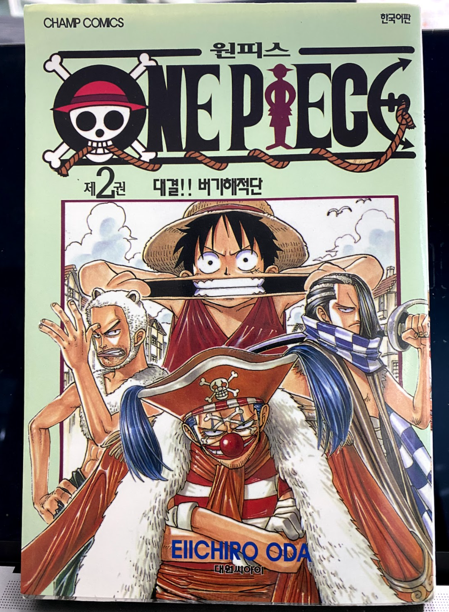

## 2021/06/28
#### 1.Flat Bench Press\[Machine, Smith\]: 40kg 12reps 5sets
#### 2.Chest Fly\[Machine, Pec Deck\]: 20kg 12reps 5sets 
#### 3.Shoulder Press\[Dumbbell\]: 5kg 12reps 5sets
#### 4.Shoulder Press\[Barbell\]: 10kg 12reps 5sets
#### 5.Side Lateral Raise\[Dumbbell\]: 4kg 12reps 5sets
#### 6.Tricep Pushdown\[Cable\]: 5kg 12reps 3sets

## 2021/06/29
#### 1.Seated Chest Press\[Machine\]: 20kg 12reps 3sets, 25kg 12reps 1set, 30kg 12reps 1set  
#### 2.Chest Fly \[Machine, Pec Deck\]: 20kg 12reps 5sets 
#### 3.Leg Extension\[Machine\]: 25kg 12reps 5sets
#### 4.Lying Leg Curls\[Machine\]: 25kg 12reps 5sets
#### 5.Lat Pulldown\[Machine\]: 20kg 12reps 2sets, 25kg 12reps 2sets, 30kg 12reps 1set  
#### 6.Seated Low Row\[Cable\]: 20kg 12reps 5sets

## 2021/06/30
#### 1.Flat Bench Press\[Machine, Smith\]: 40kg 12reps 3sets, 50kg 7reps 1set, 60kg 7reps 1set 
#### 2.Incline Bench Press\[Machine, Smith\]: 40kg 12reps 5sets  
#### 3.Shoulder Press\[Machine\]: 10kg 12reps 3sets(3th failed)
#### 4.Shoulder Press\[Barbell\]: 10kg 12reps 5sets
#### 5.Side Lateral Raise\[Dumbbell\]: 4kg 12reps 5sets

## 2021/07/01
#### 1.Lat Pulldown\[Machine\]: 20kg 12reps 3sets, 25kg 12reps 1set, 30kg 12reps 1set
#### 2.Shoulder Press\[Machine\]: 10kg 12reps 5sets
#### 3.Leg Extension\[Machine\]: 25kg 12reps 5sets
#### 4.Side Lateral Raise\[Dumbbell\]: 4kg 12reps 5sets

---
### [[[ InBody: W:60.1(kg), SMM:28.4(kg), BFM:9.1(kg), PBF:15.2(%) ]]]
---

## 2021/07/02
#### 1.Incline Bench Press\[Machine, Smith\]: 40kg 12reps 5sets 
#### 2.Chest Fly\[Machine, Pec Deck\]: 20kg 12reps 5sets 
#### 3.Shoulder Press\[Machine\]: 10kg 12reps 3sets
#### 4.Side Lateral Raise\[Dumbbell\]: 4kg 12reps 5sets
#### 5.Hanging Leg Raise: 15reps 3sets

---

