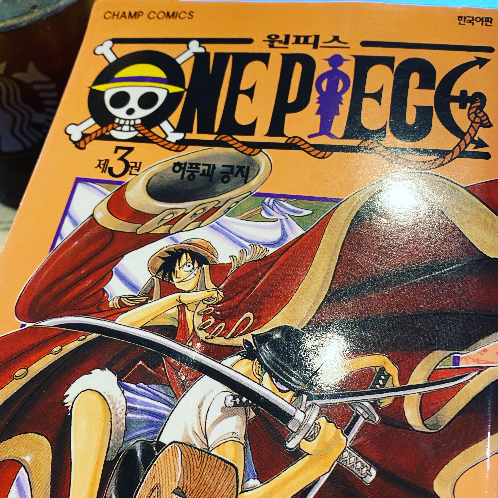

## 2021/07/05
#### 1.Lat Pulldown\[Machine\]: 20kg 12reps 1sets, 25kg 12reps 4sets, 30kg 12reps 1set  
#### 2.Low Pulley\[Machine\]: 15kg 12reps 3sets, 20kg 12reps 2sets 
#### 3.Leg Extension\[Machine\]: 20kg 12reps 3sets, 25kg 12reps 2sets 
#### 4.Incline Bench Press\[Smith Machine\]: 40kg 12reps 5sets  
#### 5.Side Lateral Raise\[Free\]: 4kg 20reps 3sets, 5kg 20reps 2sets 
#### 6.Shoulder Press\[Machine\]: 10kg 12reps 3sets(3th failed)
#### 7.Hanging Leg Raise: 20reps 3sets(3th failed)

## 2021/07/06
#### 1.Shoulder Press\[Machine\]: 10kg 12reps 1set, 15kg 12reps 4sets
#### 2.Seated Chest Press\[Machine\]: 20kg 12reps 1set, 25kg 12reps 4sets
#### 3.Leg Extension\[Machine\]: 25kg 12reps 5sets, 30kg 12reps 1set 
#### 4.Lying Leg Curls\[Machine\]: 25kg 12reps 5sets
#### 5.Lat Pulldown\[Machine\]: 25kg 12reps 5sets
#### 6.Assisted Pullup\[Machine\]: -50kg 12reps 3sets(3th failed)

## 2021/07/07
#### 1.Shoulder Press\[Machine\]: 15kg 12reps 5sets
#### 2.Side Lateral Raise\[Free\]: 4kg 20reps 5sets
#### 3.Incline Bench Press\[Smith Machine\]: 30kg 12reps 3sets, 40kg 12reps 3sets
#### 4.Chest Fly \[Pec Deck Fly Machine\]: 20kg 12reps 5sets 
#### 5.Low Pulley\[Machine\]: 20kg 12reps 5sets 
#### 6.Hanging Leg Raise: 5kg 20reps 3sets(3th failed)

## 2021/07/08
#### 1.Flat Bench Press\[Smith Machine\]: 40kg 12reps 5sets
#### 2.Incline Bench Press\[Smith Machine\]: 30kg 12reps 5sets
#### 3.Lat Pulldown\[Machine\]: 20kg 12reps 3sets, 25kg 12reps 2sets  
#### 4.Assisted Pullup\[Machine\]: -50kg 12reps 5sets(5th failed)
#### 5.Power Leg Press\[Machine\]: 40kg 12reps 5sets
#### 6.Dumbbell Squat\[Free\]: 4kg 12reps 5sets

---

