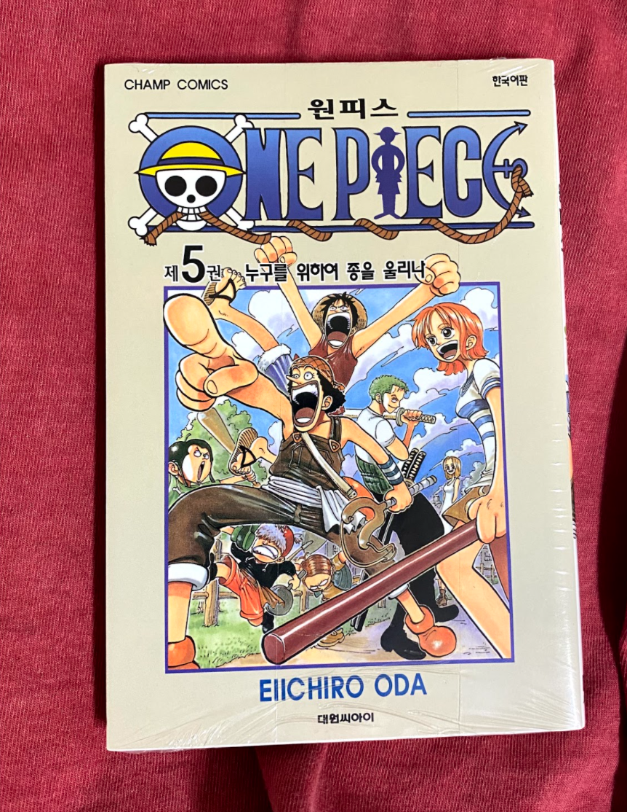

## 2021/07/19
#### 1.Incline Bench Press\[Smith Machine\]: 30kg 12times 3sets, 35kg 12times 3sets, 40kg 12times 4sets(3rd failed) 
#### 2.Lat Pulldown\[Machine\]: 20kg 12times 3sets, 25kg 12times 3sets, 30kg 12times 2sets,(1st, 2nd failed)   
#### 3.Seated Chest Press\[Machine\]: 20kg 12times 3set, 25kg 12times 3sets, 30kg 12times 3sets(1st, 2nd failed)
#### 4.Seated Leg Press\[Machine\]: 40kg 12times 5sets
#### 5.Side Lateral Raise\[Free\]: 5kg 20times 5sets

## 2021/07/21
#### 1.Assisted Pullup\[Machine\]: -50kg 12times 3sets, -45kg 12times 5sets(4th, 5th failed)
#### 2.Low Pulley\[Machine\]: 20kg 12times 5sets, 25kg 12times 3sets(2nd, 3rd failed)  
#### 3.Incline Bench Press\[Smith Machine\]: 40kg 12times 5sets
#### 4.Seated Chest Press\[Machine]: 20kg 12times 5set, 25kg 12times 4sets(3rd, 4th failed)
#### 5.Power Leg Press\[Machine\]: 40kg 12times 7sets(6th failed)
#### 6.Lat Pulldown\[Machine\]: 20kg 12times 3sets, 25kg 12times 3sets(2nd, 3rd failed)   
#### 7.Side Lateral Raise\[Free\]: 5kg 20times 6sets

---

