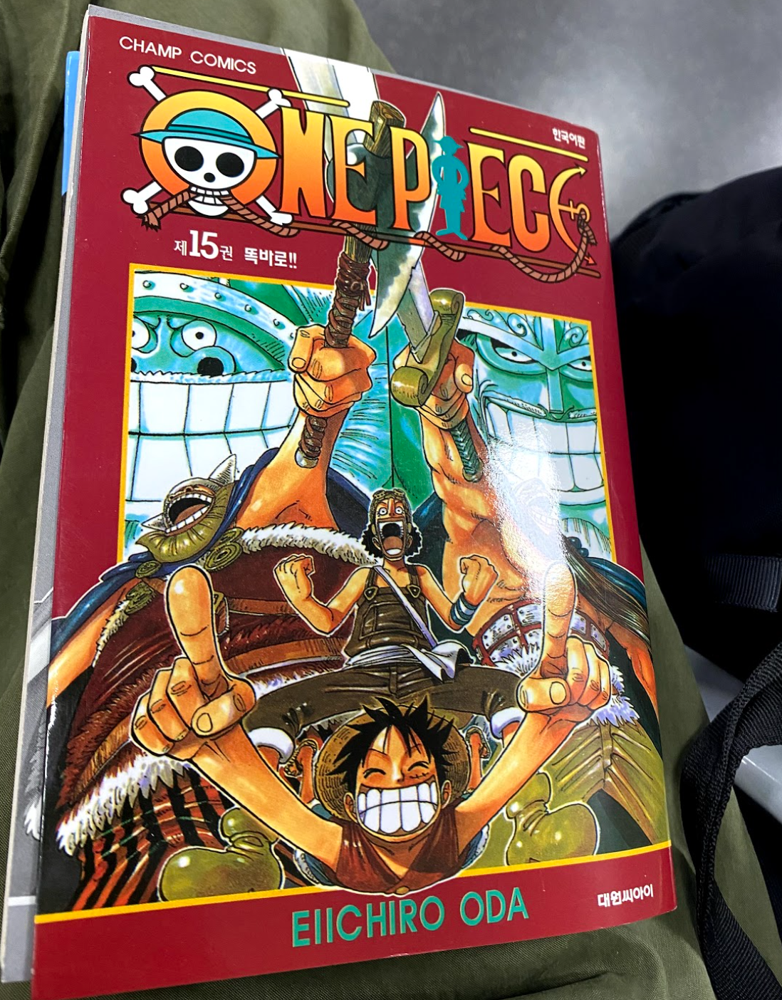

## 2021/10/18
#### 01.Lat Pulldown\[Machine\]: 25kg 20times 4sets
#### 02.Low Pulley\[Machine\]: 25kg 20times 4sets
#### 03.Seated Row\[Machine\]: 25kg 20times 4sets
#### 04.Seated Chest Press\[Machine\]: 30kg 20times 4sets
#### 05.Leg Extension\[Machine\]: 25kg 20times 4sets
#### 06.Kettlebell Deadlift\[Free\]: 20kg 20times 4sets
#### 07.Barbell Deadlift\[Free\]: 20kg 20times 4sets
#### 08.Lying Leg Curls\[Machine\]: 20kg 20times 4sets
#### 09.Hip Adduction\[Machine\]: 30kg 20times 4sets
#### 10.Side Lateral Raise\[Free\]: 5kg 20times 4sets

## 2021/10/19
#### 1.Side-lying Hip Abduction: 30times 3sets
#### 2.Basic Squat: 30times 3sets
#### 3.Kettlebell Goblet Squat\[Free\]: 5kg 15times 5sets
#### 5.Barbell Deadlift\[Free\]: 20kg 20times 4sets
#### 6.Lying Leg Curls\[Machine\]: 20kg 20times 4sets
#### 7.Power Leg Press\[Machine\]: 20kg 20times 4sets

## 2021/10/20
#### 1.Hip Bridge: 30times 3sets
#### 2.Kettlebell Deadlift\[Free\]: 20kg 20times 4sets
#### 3.Barbell Deadlift\[Free\]: 20kg 20times 4sets
#### 4.Lying Leg Curls\[Machine\]: 20kg 20times 4sets
#### 5.Hip Adduction\[Machine\]: 30kg 20times 4sets
#### 6.Seated Row\[Machine\]: 25kg 20times 4sets
#### 7.Power Leg Press\[Machine\]: 20kg 20times 4sets
#### 8.Leg Extension\[Machine\]: 25kg 20times 4sets

## 2021/10/21
#### 1.Hip Bridge: 30times 3sets
#### 2.Hip Thrust: 30times 4sets
#### 3.Barbell Deadlift\[Free\]: 20kg 20times 4sets
#### 4.Back Extension: 15times 4sets
#### 5.Push Up: 20times 3sets
#### 6.Seated Chest Press\[Machine\]: 25kg 20times 4sets
#### 7.Flat Chest Press\[Machine\]: 25kg 20times 4sets

## 2021/10/22
#### 01.Lat Pulldown\[Machine\]: 25kg 20times 4sets
#### 02.Low Pulley\[Machine\]: 25kg 20times 4sets
#### 03.Seated Row\[Machine\]: 25kg 20times 4sets
#### 04.Leg Extension\[Machine\]: 25kg 20times 4sets
#### 05.Hip Bridge: 30times 3sets
#### 06.Dumbbell Deadlift\[Free\]: 20kg 20times 4sets
#### 07.Barbell Deadlift\[Free\]: 20kg 20times 4sets
#### 08.Lying Leg Curls\[Machine\]: 20kg 20times 4sets
#### 09.Back Extension: 15times 4sets
#### 10.Hip Adduction\[Machine\]: 30kg 20times 4sets
#### 11.Seated Chest Press\[Machine\]: 30kg 20times 4sets

## 2021/10/24
#### 1.Push Up: 20times 3sets
#### 2.Seated Chest Press\[Machine\]: 25kg 20times 4sets
#### 3.Flat Chest Press\[Machine\]: 25kg 20times 4sets
#### 4.Hip Bridge: 30times 3sets
#### 5.Dumbbell Deadlift\[Free\]: 20kg 20times 4sets
#### 6.Barbell Deadlift\[Free\]: 20kg 20times 4sets
#### 7.Lying Leg Curls\[Machine\]: 20kg 20times 4sets
#### 8.Back Extension: 15times 4sets
#### 9.Hip Adduction\[Machine\]: 30kg 20times 4sets

---

