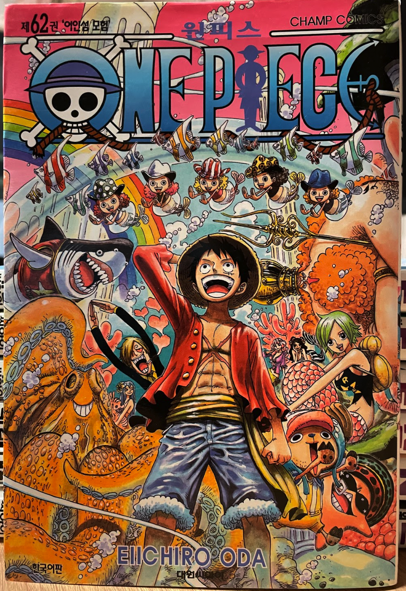

## 2022/11/08
#### 1.Side Lateral Raise\[Dumbbell\]: 6kg 15reps 5sets
#### 2.Reverse Pec Deck Fly\[Pec Deck Machine\]: 35kg 15reps 5sets
#### 3.Arnold Press\[Dumbbell\]: 12kg 12reps 5sets
#### 4.Military Press\[Smith Machine\]: 35kg 15reps 5sets
#### 5.Shoulder Press\[Machine\]: 30kg 15reps 5sets
#### 6.Upright Row\[EZ Curl Bar\]: 15kg 15reps 5sets
#### 7.Behind The Neck Press\[Smith Machine\]: 30kg 15reps 4sets

---

