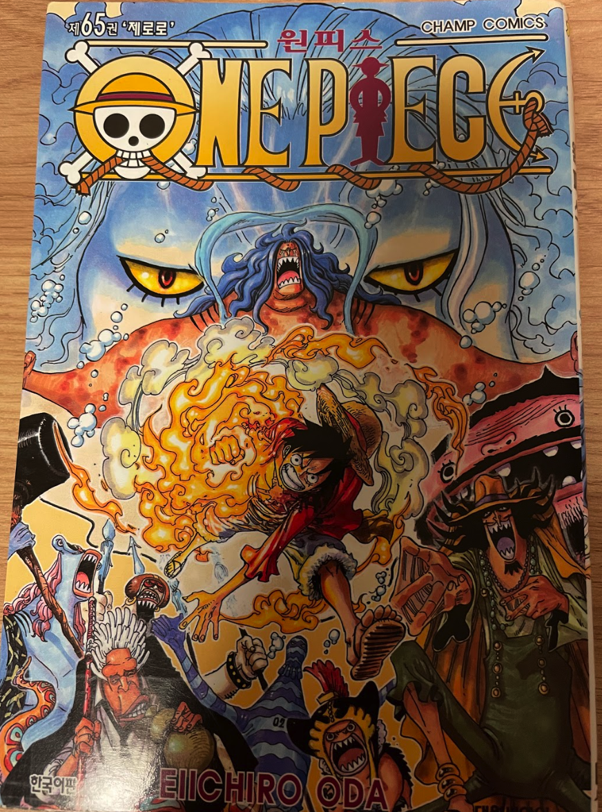

## 2022/11/28
#### 1.Side Lateral Raise\[Dumbbell\]: 6kg 15reps 5sets
#### 2.Reverse Pec Deck Fly\[Pec Deck Machine\]: 35kg 15reps 5sets
#### 3.Arnold Press\[Dumbbell\]: 12kg 12reps 5sets
#### 4.Military Press\[Smith Machine\]: 35kg 15reps 5sets
#### 5.Upright Row\[EZ Curl Bar\]: 15kg 15reps 5sets

## 2022/11/30
#### 1.Power Leg Press\[Machine\]: 80kg 12reps 5sets
#### 2.Daedlift\[Barbell\]: 45kg 12reps 5sets
#### 3.Hip Abduction\[Machine\]: 65kg 15reps 5sets
#### 4.Split Squat\[Smith Machine\]: 30kg 12reps 5sets
#### 5.Lying Leg Curls\[Machine\]: 40kg 12reps 5sets

---

